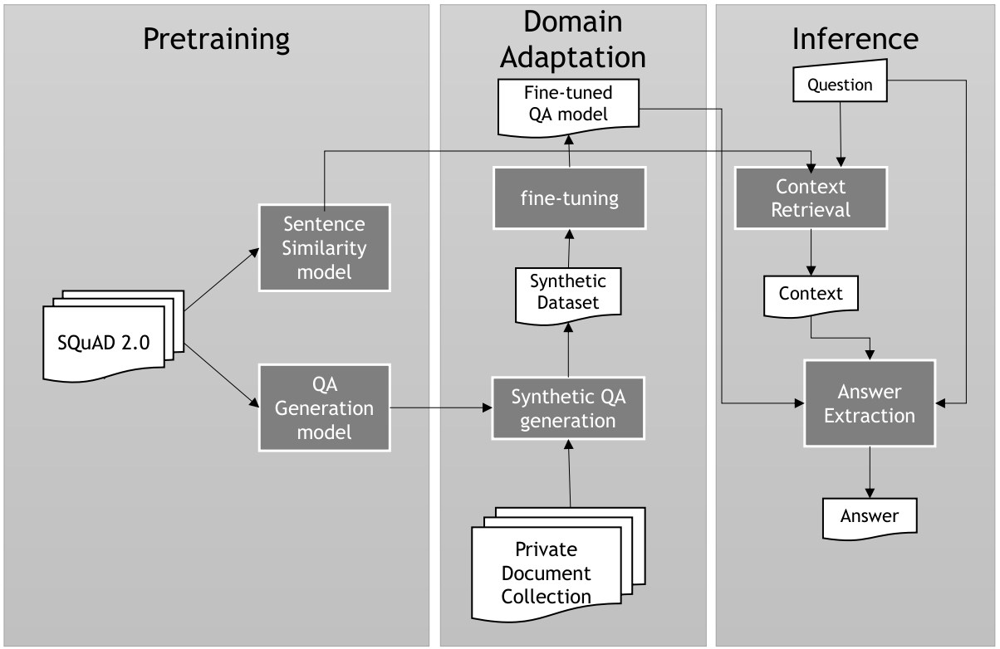

#  Self-supervised framework for Extractive queStion Answering over docuMent collEctions

SESAME is an open-source tool for domain adaptation in Open Domain Question Answer (ODQA) using only one GPU. Our method surpasses several state-of-the-art (SOTA) results in ODQA, including outperforming ChatGPT 3.5 in certain scenarios. In some instances, our performance even matches that of models fine-tuned on labeled data. SESAME boasts the ability to adapt to specific domains with less than 24 hours of training time on a single GPU, making it accessible to companies with limited resources. We have rigorously tested SESAME across various datasets and languages, demonstrating its versatility and effectiveness. The figure below show an overview of SESAME:




## Installation instructions

1 - Create a mamba/conda environment with the following command:

```mamba create -n sesame python=3.11```

2 - Activate the environment with the following command:

```conda activate sesame```

3 - Install dependencies with the following commands:

```
pip install -r requirements.txt
conda install -c conda-forge faiss-gpu # for some reason it does not work with pip
```

## Pretraining foundation models

You don't have to pretrain the foundation models to run experiments. We provide them in HuggingFace model hub. 

* sentence-similrity English [vabatista/sbert-mpnet-base-bm25-hard-neg](https://huggingface.co/vabatista/sbert-mpnet-base-bm25-hard-neg)
* sentence-similarity Portuguese [vabatista/sbert-mpnet-base-bm25-hard-neg-pt-br](https://huggingface.co/vabatista/sbert-mpnet-base-bm25-hard-neg-pt-br)
* Answer Extraction English [vabatista/t5-small-answer-extraction-en](https://huggingface.co/vabatista/t5-small-answer-extraction-en)
* Question Generation English [vabatista/t5-small-question-generation-en](https://huggingface.co/vabatista/t5-small-question-generation-en)
* Answer Extraction Portuguese [vabatista/question-generation-t5-small-pt-br-2](https://huggingface.co/vabatista/question-generation-t5-small-pt-br-2)
* Question Generation Portuguese [vabatista/question-generation-t5-small-pt-br-2](https://huggingface.co/vabatista/question-generation-t5-small-pt-br-2) ** We train the model jointly for QA and AE for portuguese, so same model for both tasks.


However, if you want to pretrain them, you can use the following commands:

### Train SentenceTransformers from scratch

```
 python pretraining/sentence_embedding/finetune-sbert-bi-encoder.py \
    --use_pre_trained_model \
    --epochs 2 \
    --train_file qa-datasets/sbert/squad-2.0-hard-neg-v2.json \
    --model_name sentence-transformers/all-mpnet-base-v2
```


### Train Question-generation models from scratch

The code for this step is based in [this github repository](https://github.com/patil-suraj/question_generation).

Prepare data for training (replace `ans_ext` with `qg` for question generation):

```
python prepare_data.py \
    --task ans_ext \
    --model_type t5 \
    --dataset_path data/squad_v2 \
    --qg_format highlight_qg_format \
    --max_source_length 512 \
    --max_target_length 32 \
    --train_file_name train_data_ans_ext_t5.pt \
    --valid_file_name valid_data_ans_ext_t5.pt \
    --tokenizer tokenizer_path_or_id \
    --valid_for_qg_only 
```    

Train T5 models (replace `ans_ext` with `qg` for question generation):

```
python run_qg.py \
    --model_name_or_path t5-small \
    --model_type t5 \
    --tokenizer_name_or_path t5_qg_tokenizer \
    --output_dir ./saved-models/t5-small-ans-ext \
    --train_file_path data/train_data_ans_ext_t5.pt \
    --valid_file_path data/valid_data_ans_ext_t5.pt \
    --per_device_train_batch_size 32 \
    --per_device_eval_batch_size 32 \
    --learning_rate 1e-4 \
    --num_train_epochs 10 \
    --seed 5 \
    --do_train \
    --do_eval \
    --logging_steps 100 \
    --remove_unused_columns False \
    --evaluation_strategy epoch \
    --save_strategy epoch \
    --save_total_limit 2 \
    --warmup_ration 0.1
```

## Domain Adaptation

To generate synthetic data from a collection of contexts from a jsonl file, run the following command:

```
python domain_adaptation/generate_synthetic_data.py \
    --t5_model_name vabatista/t5-small-question-generation-en \
    --t5_ans_model_name vabatista/t5-small-answer-extraction-en \
	--input_file ./qa-datasets/SQuAD_modified.jsonl \
	--output_file ./qa-datasets/SQuAD_synthetic.jsonl 
```

You need to adapt this code if your input is in different format from [MRQA 2019 datasets](https://github.com/mrqa/MRQA-Shared-Task-2019).


## Reproduce Experimental Setup

### Run Information Retrieval Experiment

```
python experiments/evaluate_ir.py \
    --similarity_model_path vabatista/sbert-mpnet-base-bm25-hard-neg \
    --input_file qa-datasets/originals/DROP-dev_modified.jsonl \
    --top_k 10 \
    --use_rank_fusion

```

### Run one full experiment

1. Download the LLama model following these [instructions](https://github.com/Lightning-AI/lit-gpt/blob/main/tutorials/download_llama_2.md)

2. Run the following command:

```
python experiments/full_experiment.py \
	--base_model_name saved-models/meta-llama/Llama-2-7b-hf \
	--train_input_file qa-datasets/datasets/synth/DROP-dev.json \
	--epochs 1 \
	--similarity_model_path vabatista/sbert-mpnet-base-bm25-hard-neg \
	--input_file qa-datasets/datasets/originals/DROP-dev_modified.jsonl \
    --top_k_contexts 5 \
    --test_split 0.2 \
    --lr 1e-3  \
    --language en \ # or pt for portuguese
    --do_search --do_train --do_eval \ # the remaining of parameters are for LLaMA
    --temperature 0.1 \
    --top_p 0.8 \
    --top_k 200 \
    --llm \
    --use_hf_ft # This is optional for LLM and uses huggingface fine-tuning instead of lit-gpt. 
```
Huggingface finetuning is slower, but allows you to run with any model from huggingface model hub. LitGPT is faster, uses less memory, but it supports only [some models](https://github.com/Lightning-AI/lit-gpt?tab=readme-ov-file#-lit-gpt-1).
We also created several shell scripts to run a series of experiments in /experiments folder. You can use them as a reference to run your own experiments.

### Datasets Download

Download the orignal, our synthetic, wikipedia caches and sbert datasets used in the experiments [here](https://drive.google.com/file/d/13tCAk5BU1vZm9esg1jzdRoliunKqe7dl/view?usp=drive_link) (4.5GB).


### Results Download

You can download results and models predictions from article from this [link](https://drive.google.com/file/d/1yXRPxGTwiTgDUrckkGD0mlUjDVdB-fqi/view?usp=drive_link) (205 MB) and here the file containing the [Ablation Study](https://drive.google.com/file/d/1hHQVOFatKC6b31LdPJH1bOOgrH6feQaR/view?usp=drive_link) (2MB). This way you can audit results and compare to your own experiments.

### Cite this work

```
@Article{vabatista2024,
	author={Batista, Vitor A. and Gomes, Diogo S. M. and Evsukoff, Alexandre},
	title={SESAME - self-supervised framework for extractive question answering over document collections},
	journal={Journal of Intelligent Information Systems},
	year={2024},
	month={Jul},
	day={30},
	abstract={Question Answering is one of the most relevant areas in the field of Natural Language Processing, rapidly evolving with promising results due to the increasing availability of suitable datasets and the advent of new technologies, such as Generative Models. This article introduces SESAME, a Self-supervised framework for Extractive queStion Answering over docuMent collEctions. SESAME aims to enhance open-domain question answering systems (ODQA) by leveraging domain adaptation with synthetic datasets, enabling efficient question answering over private document collections with low resource usage. The framework incorporates recent advances with large language models, and an efficient hybrid method for context retrieval. We conducted several sets of experiments with the Machine Reading for Question Answering (MRQA) 2019 Shared Task datasets, FAQuAD - a Brazilian Portuguese reading comprehension dataset, Wikipedia, and Retrieval-Augmented Generation Benchmark, to demonstrate SESAME's effectiveness. The results indicate that SESAME's domain adaptation using synthetic data significantly improves QA performance, generalizes across different domains and languages, and competes with or surpasses state-of-the-art systems in ODQA. Finally, SESAME is an open-source tool, and all code, datasets and experimental data are available for public use in our repository.},
	issn={1573-7675},
	doi={10.1007/s10844-024-00869-6},
	url={https://doi.org/10.1007/s10844-024-00869-6}
}
```


## TODO

- [ ] Make adapters to read contexts from pdf and txt
- [ ] Create a web interface to interact with the model
- [ ] Create a docker container to run the model
